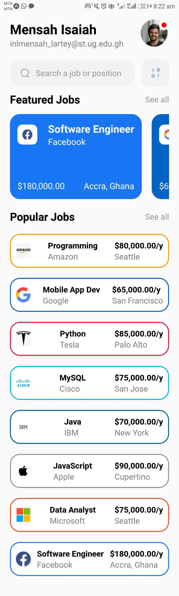
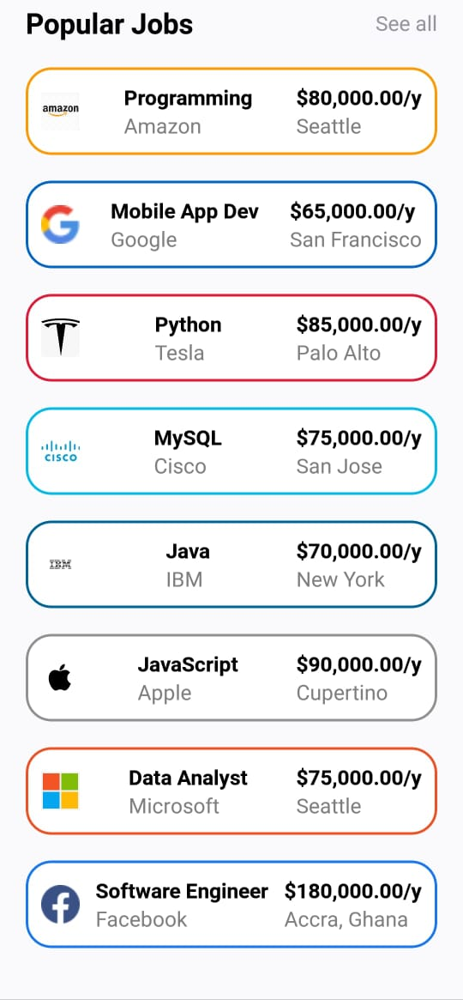
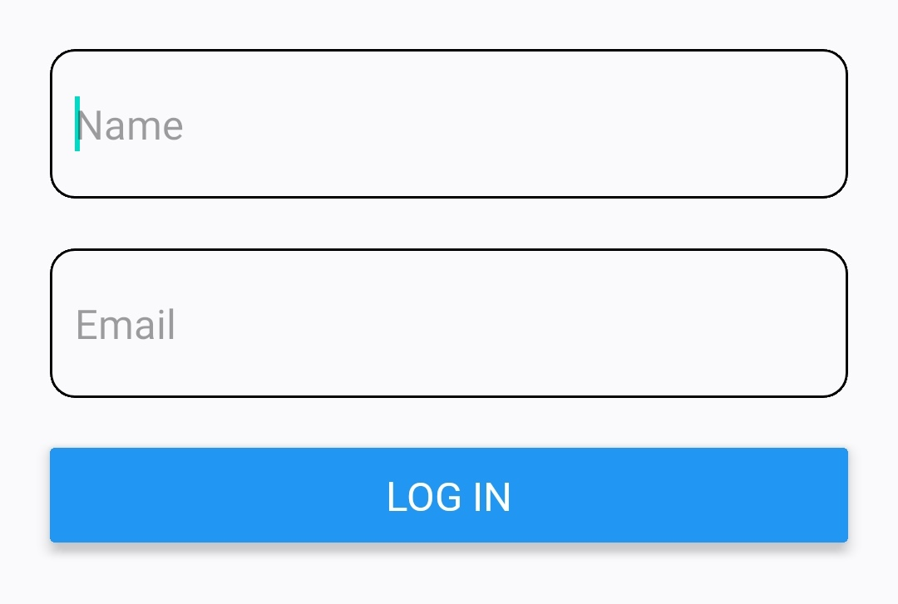
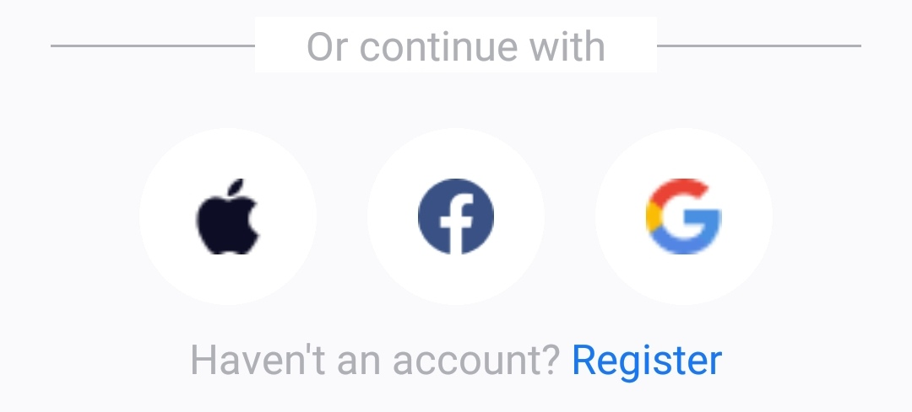

# rn-assignment4-11222100

### Component Descriptions

#### Screen Components

---

1. **HomePage.js**:
    - **Description**: This is the main screen for the home page of the application. It integrates multiple helper components to provide a comprehensive interface for users.
    - **Components Used**: 
        - `FrameOne.js`
        - `Search.js`
        - `FeaturedJobs.js`
        - `PopularJobs.js`

 

 
Home Screen.
 

---

2. **LoginPage.js**:
    - **Description**: This screen renders the login interface where users can enter their credentials to log in.
    - **Components Used**: 
        - `WelcomeSection.js`
        - `FormSection.js`
        - `EndFrame.js`

 

 
Login Screen.
 

---

#### Helper Components
---

1. **FrameOne.js**:
    - **Description**: This component holds the first section of the `HomePage` component, likely displaying a header or introductory content.

 

 
FrameOne Component.
 

---

2. **Search.js**:
    - **Description**: This component renders the search bar section in the `HomePage` component, allowing users to search for jobs.

 

 
FrameOne Component.
 

---

3. **FeaturedJobs.js**:
    - **Description**: This component renders a FlatList section that holds featured job listings on the `HomePage` component.

 

 
FrameOne Component.
 

---

4. **PopularJobs.js**:
    - **Description**: This component renders the most popular jobs found in the `HomePage` component.

 

 
FrameOne Component.
 

---

5. **WelcomeSection.js**:
    - **Description**: This component renders the welcome portion of the `LoginPage`, displaying a welcome message and introductory content.

 

 
FrameOne Component.
 

---

6. **FormSection.js**:
    - **Description**: This component holds the form aspect of the screen in the `LoginPage` component, including inputs for username and password.

 

 
FrameOne Component.
 

---

7. **EndFrame.js**:
    - **Description**: This component renders the available options to the user in case login isn't an option, such as options to sign in with a facebook, google or apple account or to  "Register".

 

 
FrameOne Component.
 

---

### Interaction Between Components

- `HomePage.js` uses `FrameOne.js` to display introductory content or a header.
- `Search.js` in `HomePage.js` allows users to input search terms, triggering searches.
- `FeaturedJobs.js` and `PopularJobs.js` in `HomePage.js` display job listings, each receiving data and selection handlers through props.
- `LoginPage.js` uses `WelcomeSection.js` to display a welcome message.
- `FormSection.js` in `LoginPage.js` collects user credentials and triggers login actions.
- `EndFrame.js` in `LoginPage.js` provides the user with other options in case login isn't an option, such as options to sign in with a facebook, google or apple account or to  "Register".

